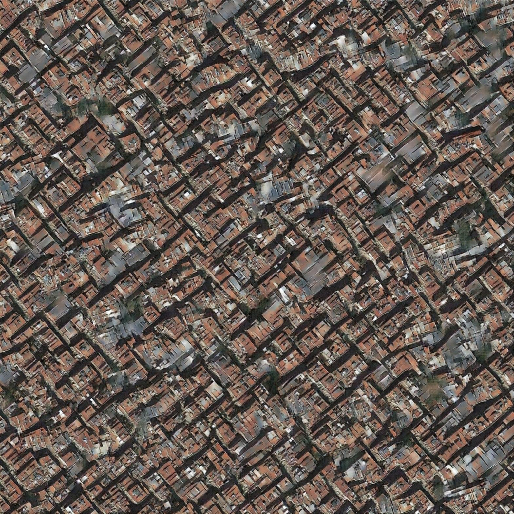

# Spatial Generative Adversarial Networks

This code implements Spatial Generative Adversarial Networks (SGANs) on top of Lasagne/Theano, as published in the paper
[https://arxiv.org/abs/1611.08207](https://arxiv.org/abs/1611.08207)

The code was tested on top of Lasagne (version 0.2.dev1) and Theano (0.9.0dev2).

### Very Brief Model Description
SGANs can generate sample textures of arbitrary size that look strikingly similar - but not exactly the same - compared to a single (or several) source image(s).
- SGANs can be thought of as a convolutional roll-out of [Radford et al.'s](https://github.com/Newmu/dcgan_code) deep convolutional generative adversarial networks for texture synthesis
- the fully convolutional nature allows for real-time generation of high resolution images
- the method can fuse multiple source images and is highly scalable w.r.t. to output texture size and allows for generation of tiled textures


### Examples
You can generate samples from a stored model. E.g. you can use the checked-in model:
```
python demo_generation.py models/barcac_filters64_npx257_5gL_5dL_epoch50.sgan
```
This model was trained on a google maps image of barcelona, and yields a texture image like e.g. this




### Training the Model
To train the model on new images, edit the config.py file and set the texture_dir variable to a folder containing the image(s) you want to learn from. You might also want to change other parameters of the network there (e.g. depth, number of filters per layer etc...). Then run
```
python sgan.py
```
to train the model. Snapshots of the model will be stored in the subfolder models/ and samples after each epoch will be stored in samples/

### Contact
- Urs Bergmann    (ursbergmann@gmail.com)
- Nikolay Jetchev (nikolay.jetchev@zalando.de)
- Roland Vollgraf (roland.vollgraf@zalando.de)


## License

The MIT License (MIT)

Copyright © 2016 Zalando SE, https://tech.zalando.com

Permission is hereby granted, free of charge, to any person obtaining a copy
of this software and associated documentation files (the "Software"), to deal
in the Software without restriction, including without limitation the rights
to use, copy, modify, merge, publish, distribute, sublicense, and/or sell
copies of the Software, and to permit persons to whom the Software is
furnished to do so, subject to the following conditions:

The above copyright notice and this permission notice shall be included in all
copies or substantial portions of the Software.

THE SOFTWARE IS PROVIDED "AS IS", WITHOUT WARRANTY OF ANY KIND, EXPRESS OR
IMPLIED, INCLUDING BUT NOT LIMITED TO THE WARRANTIES OF MERCHANTABILITY,
FITNESS FOR A PARTICULAR PURPOSE AND NONINFRINGEMENT. IN NO EVENT SHALL THE
AUTHORS OR COPYRIGHT HOLDERS BE LIABLE FOR ANY CLAIM, DAMAGES OR OTHER
LIABILITY, WHETHER IN AN ACTION OF CONTRACT, TORT OR OTHERWISE, ARISING FROM,
OUT OF OR IN CONNECTION WITH THE SOFTWARE OR THE USE OR OTHER DEALINGS IN THE
SOFTWARE.
